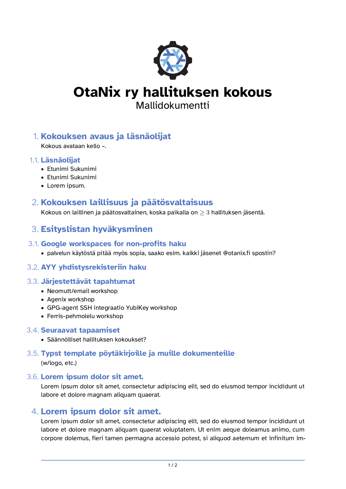

# OtaNix ry typst-packages

Typst packages providing various OtaNix related document templates and styles.

## Templates

### Board-meeting

The OtaNix board-meeting document template (w/logo)



This template is mostly adapted from

- https://github.com/DVDTSB/dvdtyp/
  
  Copyright (c) 2024 DVDTSB
- https://github.com/piepert/grape-suite/blob/main/src/exercise.typ
  
  Copyright (c) 2024 Tristan Pieper

## Getting Started

To create a new typst project which uses these typst packages you can use the provided flake template:

```shell
nix flake init -t github:OtaNix-ry/typst-packages
```

This creates a new flake with the following sample typst document

```typst
#import "@otanix/board-meeting:0.1.0": *

#show: meeting.with(
  title: "OtaNix ry hallituksen kokous",
  subtitle: "Mallidokumentti"
)
```

### Without flakes

TODO npins

## Adding to an existing typix project

Check the [`examples/quick-start/flake.nix`](./examples/quick-start/flake.nix) flake and adapt it to your needs.

## License

MIT License. [See the full license.](./LICENSE)